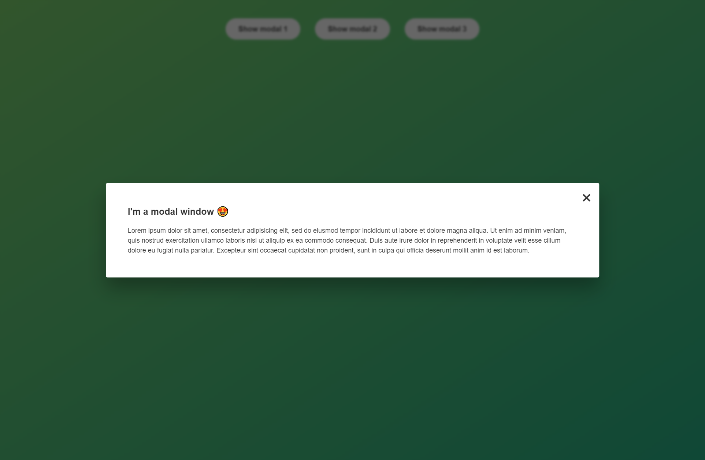
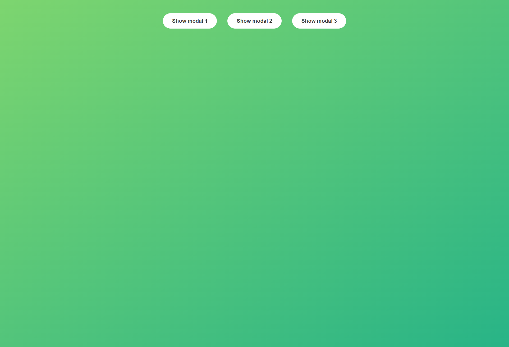

# Pop-up Window that closes by clicking anywhere
### The Complete JavaScript Course 2021: From Zero to Expert! | [Udemy.com](https://www.udemy.com/course/the-complete-javascript-course/)
<!-- * `Purchased Course`: 24.09.2020 -->
<!-- * `Finished this Project`: 07.04.2021 12:50 -->

## Description
Simple but useful feature of any website, this pop-window can be cancelled by clicking anywhere on the page.

## Entry Point
Open `index.html` file in the browser window.

